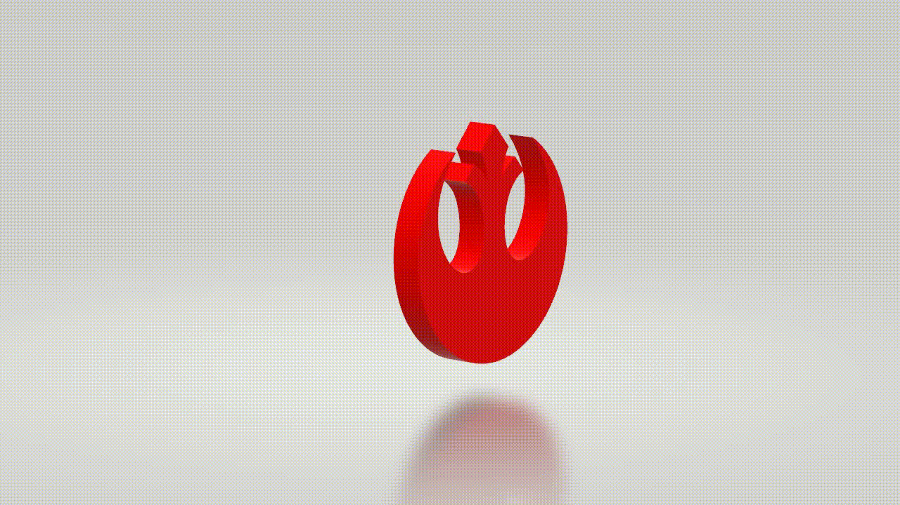

# Star Wars - The Last X-Wing

### The Trailer

https://user-images.githubusercontent.com/37783178/125081563-c7402580-e0e3-11eb-8433-c179aa623f05.mov

### The Models

##### The X-Wing

#### The Imperial Tie-Fighter

#### The Rebellion Crest

### The Gameplay

(Movement lag due to recording software)

#### What's there to see?

1. The final cut of the trailer, saved as `Trailer/TLX Trailer.mov`.
2. The final game. To run it, the `Game` directory needs to be hosted on a local server. You may use `http-server` from `npm` or use `python3 -m http.server`.

#### How to play the game?

Sticking close to the inspiration from Skyforce, the controls are mouse based. The player's ship follows the mouse. Holding down the left mouse button fires laser bolts.

Enemies are spawned at random intervals and fly into view. Some follow a straight trajectory (70%), while the others track the player's current position and fly straight at the player.

If the player an enemy figther with a laser shot, the enemy explodes and the adds 5 to the player's score. Upon exploding, the enemy also releases a coin (in the shape of the Rebel Alliance Crest). Collecting a coin gives an additional 1 increment to the player's score.

If an enemy ship hits the player's ship, the enemy ship explodes, but along with it, it also does 25% damage to the player. As such the player can only survive 4 such hits before the game is over.

#### Techincal Details:

1. All models used in the game were made using Blender (X-Wing, TIE Fighter, Rebel Alliance Crest).
2. Dogfight cutscenes were animated in Unity.
3. Stills were designed in Photoshop.
4. Trailer was compiled in iMovie.
5. Game was made in JS with Three.js.
